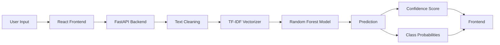

#  Mental Health Sentiment Analysis

An end-to-end Machine Learning application for multi-class mental health sentiment classification. The project covers the complete ML lifecycle—from data preprocessing and feature engineering to model optimization, REST API development, and deployment.

##  Live Demo

- **Frontend:** [*Vercel*](https://ml-kohl-nine.vercel.app/)
- **Backend API:** *[*Hugging_face*](https://huggingface.co/spaces/Amogh1221/sentiment-analysis-api)*

---

#  Features

- Multi-class mental health text classification
- Classical NLP preprocessing pipeline
- Feature Engineering
- TF-IDF Vectorization
- Model comparison across multiple ML algorithms
- Hyperparameter optimization using Optuna
- FastAPI REST API
- React frontend
- Docker support
- Confidence scores and class probabilities
- Batch prediction support

---

#  Dataset

The model was trained on a mental health text dataset containing over **53,000** text samples across **7 mental health categories**.

### Classes

- Anxiety
- Bipolar
- Depression
- Normal
- Personality Disorder
- Stress
- Suicidal

### Data Cleaning

Initial dataset

- Samples: **53,043**

After preprocessing

- Samples: **51,093**

Training distribution was balanced using oversampling before model training.

---

# Project Architecture



---

#  Machine Learning Pipeline

## 1. Data Cleaning

- Removed duplicate records
- Removed missing values
- Lowercase conversion
- Regular expression cleaning

## 2. Text Preprocessing

- Tokenization
- Stopword removal
- Lemmatization
- Noise removal

## 3. Feature Engineering

Additional numerical features:

- Number of words
- Number of lines

## 4. Vectorization

- TF-IDF
- Maximum Features: **3000**

## 5. Models Evaluated

- Logistic Regression
- Linear SVC
- Decision Tree
- Random Forest
- Extra Trees
- Gradient Boosting
- Bernoulli Naive Bayes
- KNN
- XGBoost

## 6. Hyperparameter Optimization

- Framework: **Optuna**
- Trials: **100**
- Cross Validation: **3-Fold**

---

#  Model Comparison

| Model | Test Accuracy | Weighted F1 |
|--------|--------------:|------------:|
| Extra Trees | **92.50%** | **92.40%** |
| Random Forest | 91.64% | 91.45% |
| XGBoost | 90.89% | 90.68% |
| Linear SVC | 89.99% | 89.73% |
| Logistic Regression | 87.63% | 87.33% |
| Decision Tree | 87.59% | 87.07% |
| Gradient Boosting | 84.40% | 84.01% |
| BernoulliNB | 67.64% | 68.36% |
| KNN | 59.99% | 56.78% |

---

#  Final Deployed Model

The deployed application uses a hyperparameter-tuned **Random Forest Classifier**.

### Performance

| Metric | Score |
|--------|-------:|
| Test Accuracy | **91.90%** |
| Weighted F1 Score | **91.78%** |
| Log Loss | **0.2654** |

---

#  Hyperparameter Optimization

Best Random Forest Parameters

```python
{
    "n_estimators": 200,
    "criterion": "gini",
    "max_features": "log2",
    "min_samples_split": 6,
    "min_samples_leaf": 1,
    "bootstrap": False,
    "random_state": 42
}
```

---

#  Tech Stack

### Machine Learning

- Python
- Scikit-learn
- Pandas
- NumPy
- Optuna

### NLP

- NLTK
- TF-IDF

### Backend

- FastAPI
- Pydantic

### Frontend

- React
- Vite

### Deployment

- Docker
- Hugging Face Spaces
- Vercel

---

#  Project Structure

```
Mental-Health-Sentiment-Analysis
│
├── Backend
│   ├── artifacts
│   │   ├── model.pkl
│   │   ├── tfidf.pkl
│   │   └── encoder.pkl
│   ├── main.py
│   └── requirements.txt
│
├── Frontend
│   ├── src
│   ├── package.json
│   └── vite.config.js
│
├── SA.ipynb
├── README.md
└── requirements.txt
```

---

#  Installation

Clone the repository

```bash
git clone https://github.com/Amogh1221/ML.git
```

Install dependencies

```bash
pip install -r requirements.txt
```

Run backend

```bash
cd Backend

uvicorn main:app --reload
```

Run frontend

```bash
cd Frontend

npm install

npm run dev
```

---

#  Future Improvements

- Transformer-based models (BERT / RoBERTa)
- ONNX model optimization
- Model monitoring
- Explainable AI using SHAP
- Continuous model retraining
- CI/CD pipeline

---

#  Author

**Amogh Gupta**

GitHub: https://github.com/Amogh1221
